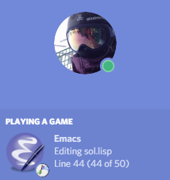

# elcord
## Discord Rich Presence for Emacs

Show off your emacs-savy ways to all your Discord friends and strangers.

This package will connect with a local Discord client to update your status via the Discord Rich Presence API.

## Installing

Just take elcord.el file and stick it somewhere in your load path and load it.

There are customization options available.
Try
`M-x customize-group RET elcord RET`

After it's loaded, call `elcord-connect` to start elcord.

### Note for Windows

tldr: Make sure that the [stdpipe.ps1](stdpipe.ps1) is in the same directory as the elcord.el file.

Talking with Discord's IPC mechanism is achieves through the PowerShell script [stdpipe.ps1](stdpipe.ps1). This is to get around Emacs' inability to talk through named pipes on Windows.

Everything should work out-of-the-box. Just make sure this PowerShell script is installed in the same directory as your elcord.el file.

## Icons

While the alist `elcord-mode-icon-alist` is customizable, all icon ID's are linked to the application pointed to by `elcord-client-id`.

For adding icons, you have two options:

1. Contact [me](zulu.inuoe@gmail.com) to add them
2. Create your own 'Application' with its own set of icons.

For creating an 'Application': Visit Discord's [application page](https://discordapp.com/developers/applications/me/)
Create a new application and upload icons as a "small" asset.

Atfer you've created your application, Customize `elcord-client-id` to be the new application's client ID.
